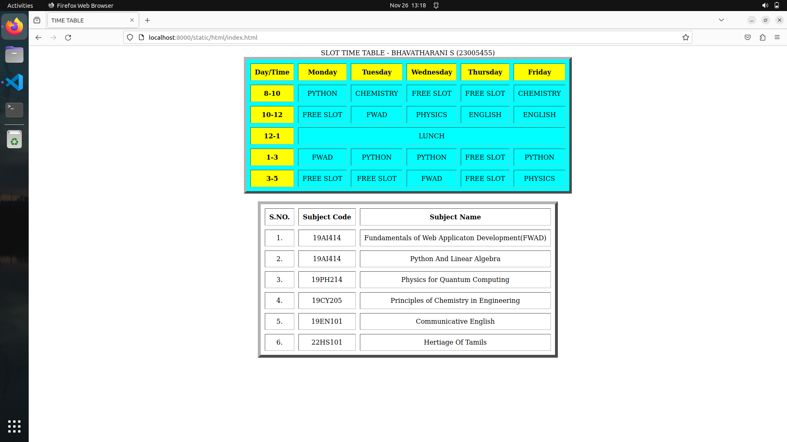

# Experiment_Time_Table

## AIM
To Write a html webpage page to display your timetable.

# ALGORITHM
### STEP 1
create a simple table using table tag
### STEP 2
Add header row using th tag
### STEP 3
Add your timetable
### STEP 4
Execute the program

# CODE
``````
<html>
   <title> TIME TABLE </title>
   <body>
   <center>
<table border="6" bgcolor="cyan" cellspacing="10" cellpadding="10">
<caption> SLOT TIME TABLE - BHAVATHARANI S (23005455) </caption>

<tr bgcolor="blue">
     <th> Day/Time </th>
     <th> Monday </th>
     <th> Tuesday </th>
     <th> Wednesday </th>
     <th> Thursday </th>
     <th> Friday </th> 
</tr>
<tr align="center">
   <th bgcolor="red"> 8-10 </th>
   <td> PYTHON AND LINEAR ALGEBRA</td>
   <td> CHEMISTRY </td>
   <td>  FREE SLOT</td>
   <td>  HERITAGE TAMIL </td>
   <td> CHEMISTRY </td>
</tr>
<tr align="center">
    <th bgcolor="red"> 10-12 </th>
    <td> FREE SLOT</td>
    <td> FWAD </td>
    <td> PHYSICS</td>
    <td> ENGLISH </td>
    <td> ENGLISH </td>
</tr>
<tr align ="center">
    <th bgcolor="red"> 12-1 </th>
    <td colspan="5" align="center"> LUNCH </td>
</tr>
<tr align ="center">
    <th bgcolor="red"> 1-3 </th>
    <td > FREE SLOT </td>
    <td> PYTHON AND LINEAR ALGEBRA </td>
    <td> PYTHON AND LINEAR ALGEBRA</td>
    <td> FREE SLOT </td>
    <td>PYTHON AND LINEAR ALGEBRA</td>
</tr>
<tr align ="center">
    <th bgcolor="red"> 3-5 </th>
    
<td>  FREE SLOT </td>
    <td> FREE SLOT</td>
    <td> FWAD </td>
    <td> FREE SLOT </td>
    <td> PHYSICS </td>
</tr>
</tr>
</table>
<br>
<table border="7" cellspacing="10" cellpadding="10">
<tr align="center">
<th> S.NO. </th>
<th> Subject Code</th>
<th> Subject Name </th>
</tr>
<tr align="center">
<td> 1. </td>
<td> 19AI414 </td>
<td> Fundamentals of Web Applicaton Development(FWAD) </td>
</tr>
<tr align="center">
<td> 2. </td>
<td> 19HS101 </td>
<td> Heritage Tamil </td>
</tr>
<tr align="center">
<td> 3. </td>
<td> 19AI301C </td>
<td> Python And Linear Algebra (PYTHON) </td>
</tr>
<tr align="center">
<td> 4. </td>
<td> 19CY205 </td>
<td> Principles of Chemistry in Engineering  </td>
</tr>
<tr align="center">
<td> 5. </td>
<td> 19EN101</td>
<td> Communicative English </td>
</tr>
<tr align="center">
<td> 6. </td>
<td> 19PH214 </td>
<td> Physics for Quantum Computing </td>
</tr>
</html>
``````
## OUPUT:


### RESULT:
The program for creating slot timetable usingbasic HTML tags is executed successfully.

